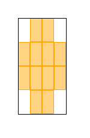

# hex-games

## Hex Fields

Hex fields in ncurses have to be constructed with characters. A sinlge field 
consists of 12 characters. A character is not a square, so the resulting hex 
field will be stratched.

The hex fields can be arragnged in two ways, as shown in the following image. 
The first image has an up / down movement while the second one has a left / right
movement. In the following considerations I will prever the up / down movement.

