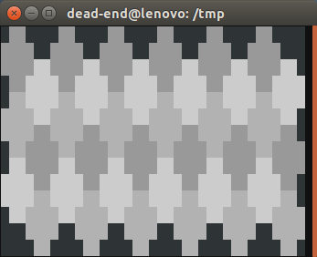

# hex-games

In this project I want to develop a ncurses based terminal game, which has 
hexagonal fields.

## Hex Fields

Hex fields in ncurses have to be constructed with characters. A sinlge field 
consists of 12 characters. A character is not a square, so the resulting hex 
field will be stratched.


The hex fields can be arragnged in two ways, as shown in the following image. 
The first image has an up / down movement while the second one has a left / right
movement. In the following considerations I will prever the up / down movement.


The hex fields can be interpreted as a two dimensional array, like it is shown
in the next illustration.


The upper left corner of the square that contains a hex field can be computed with
the formula:

```
start-column = column-index * 3

start-row    = (column-index % 2) * 2 + row-index * 4
```

Unlike the previous image, a character in ncurses has no border, so you cannot
tell adjacent hex fields with the same color. One solution is to use different
colors for adjacent hex fields.



### Color pair lookup

Since ncurses uses color pairs consisting of foreground and background colors,
the number of color pairs is exploding, when we use shadings of the background
colors. It is a good idea to use a lookup map to identify the color pair for a
given pair of forground and background colors. The number of forground and 
background colors is fixed so the map does not change during the game.
We can define a struct for the combination:

```
typedef struct {

	short fg;
	short bg;
	short cp;

} s_color_pair;
```

We create an array for the struct and keep track of the number of elements in
the array. After we added the color pairs we have to sort the result.

```
#define CP_MAX 64

size_t _cp_num = 0;

s_color_pair _cp_array[CP_MAX];

qsort(_cp_array, _cp_num, sizeof(s_color_pair), col_color_pair_comp);
```

And the we can lookup the color pair:

```
s_color_pair key = { .fg = fg, .bg = bg };

s_color_pair *result = bsearch(&key, _cp_array, _cp_num, sizeof(s_color_pair), col_color_pair_comp);
```

## Current state

