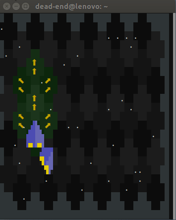

# hex-games

In this project I want to develop a ncurses based terminal game, which has 
hexagonal fields.

## Hex Fields

Hex fields in ncurses have to be constructed with characters. A sinlge field 
consists of 12 characters. A character is not a square, so the resulting hex 
field will be stratched.


The hex fields can be arragnged in two ways, as shown in the following image. 
The first image has an up / down movement while the second one has a left / right
movement. In the following considerations I will prever the up / down movement.


The hex fields can be interpreted as a two dimensional array, like it is shown
in the next illustration.


The upper left corner of the square that contains a hex field can be computed with
the formula:

```
start-column = column-index * 3

start-row    = (column-index % 2) * 2 + row-index * 4
```

Unlike the previous image, a character in ncurses has no border, so you cannot
tell adjacent hex fields with the same color. One solution is to use different
colors for adjacent hex fields.


